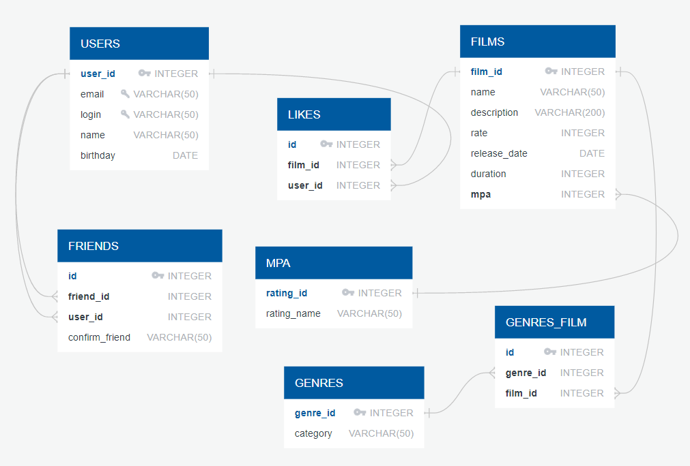

# java-filmorate

Добавлена схема базы данных

#Примеры запросов:
##ТОП N наиболее популярных фильмов

####SELECT f.name AS name
####       COUNT(l.user_id) AS like
####FROM films AS f 
####JOIN likes AS l ON f.film_id = l.film_id
####GROUP BY name
####ORDER BY like
####LIMIT N;

## Cписок общих друзей с другим пользователем

####SELECT *
####FROM (
####  SELECT DISTINCT user_id 
####  FROM friends
####  WHERE friend_id = U1 OR friend_id = U2) p1
####JOIN users as u ON u.user_id  = p1.user_id 
